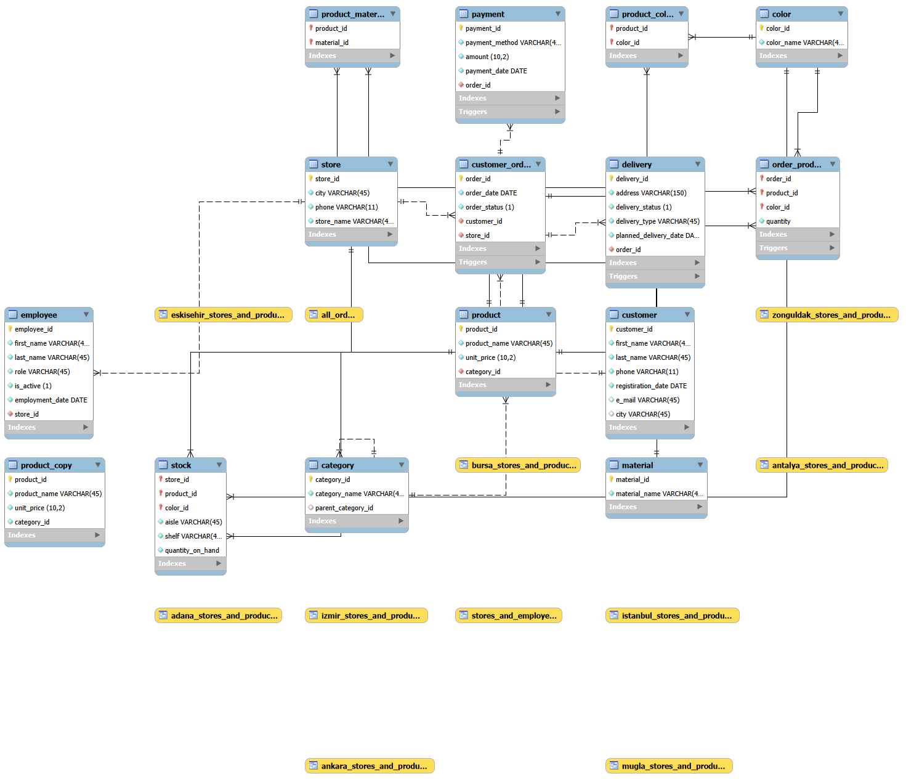

# Home Furnishing Store Database Management System

## Project Overview
This project involves the design and implementation of a comprehensive relational database for a Home Furnishing Store. It manages customers, employees, store branches, product inventory, and the complete order-to-delivery pipeline.

## Features
* **Relational Schema:** Optimized for data integrity with foreign key constraints and custom check constraints (e.g., phone number validation).
* **Automation with Triggers:** Automated stock level updates after sales and date validation for payments and deliveries.
* **Stored Procedures:** Custom procedures for handling employee hiring and dynamic stock adjustments.
* **Data Analysis:** A collection of 50+ queries covering simple CRUD operations to advanced joins and subqueries.

## Database Schema (ERD)

## How to Use
1. Clone the repository.
2. Run `sql_scripts/schema_setup(DDL).sql` to create the database structure and triggers.
3. (Optional) Import `database_dump/home_furnishing_db_dump.sql` for a fully populated database.
4. Explore the analysis in `sql_scripts/queries.sql`.

## Tech Stack
* **Database:** MySQL 8.0
* **Design Tool:** MySQL Workbench (ER Diagramming)
